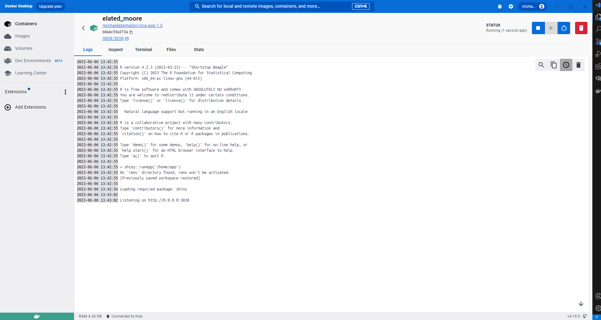

# Ginkgo

Ginkgo is a purpose-built tool aimed at facilitating non-compartmental analysis (NCA). Unlike most R packages that cater primarily to seasoned R users, Ginkgo's design centers around the notion that expertise in NCA does not necessarily entail proficiency in R. By marrying NCA expertise with a user-friendly interface, we enable a wider range of experts to contribute meaningfully to data analysis.

The NCA functionality for Ginkgo is provided by IntiQuan. Comprehensive documentation for these functions can be found on the [IntiQuan website](https://iqnca.intiquan.com/book/).

## Getting Started

There are a few approaches to run this application:

### 1) Running on R from Personal Computer

There is a guide through the documentation given [here](https://michaeld96.github.io/ginkgo-manual/). 

### 2) Downloading Docker

This Docker Image holds all the dependencies for the Ginkgo app. This resolves the issue of some libraries that the application uses may be out-of-date or incompatible for recent updated packages. To use the Docker approach:

1) Download Docker [here](https://www.docker.com/products/docker-desktop/).


2) Once Docker is installed on your system you now have access to Docker's command line interface (CLI). We first need to sign into Docker through Docker Desktop.
3) 
 <p align = "center">

</p>

1) Now we will sign into Docker. This will launch in your web browser, and after you sign in it will sign you in your Docker Desktop. *Note:* If you do not have a Docker account you must create an account to be able to `pull` the Docker Image. 

<p align = "center">

</p>

1) Next, we will go to the search bar at the top of Docker Desktop and search `michaelatamador`. Click on the Image `michaelatamador/nca-app`, and then click `Run`. 

<p align = "center">
 
</p>

5) After clicking on `Run`, click on `Opional settings`. We need to tell the container to open on port `3838` because this is where the Shiny app will open to. The screenshot below is what it should look like.

<p align = "center">
 
</p>

6) Now click `Run` and it should automatically open a window named `Logs` and this a terminal window of the R session the is being launched. It should look like the screenshot below: 

<p align = "center">

</p> 

7) Now it should be good to run! All you have to do is enter url below into your browser:
```
localhost:3838
```
8) If you see this page when you type in `localhost:3838` then the app is working correctly!

<p align = "center">
 
</p>

#### Trouble Shooting with Docker Image

Let's say your on the Ginkgo app and it crashes! It is a simple fix. Go to Docker Desktop and simply click `Restart` button. This will rerun the code to relaunch the Ginkgo app. The screenshot below shows where the `Restart` button is. Once the application is reset, feel free to type in `localhost:3838` back into your browser.

<p align = "center">

</p> 

### 3) Using AWS EC2 Instance

With this application, we have made a website for the Ginkgo app, but there is only one caveat is when the app crashes we need to start it up again.

Please, feel free to use this option and send an email to <a href = "michael.dick@amador.com">Michael</a> if the application does crash.

To visit the application visit this [link](http://ec2-18-118-18-33.us-east-2.compute.amazonaws.com:3838/).

<bold style = "color: red; font-weight: bold;"> WARNING: Only one user should be using the app as this is only one port, meaning this is only one session. If there is another individual on then both of those users will be using the app at once.</bold>
